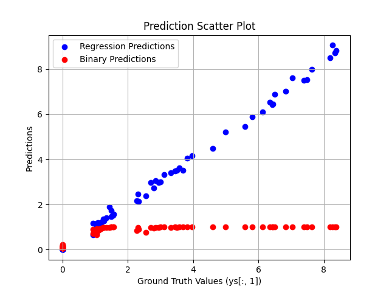
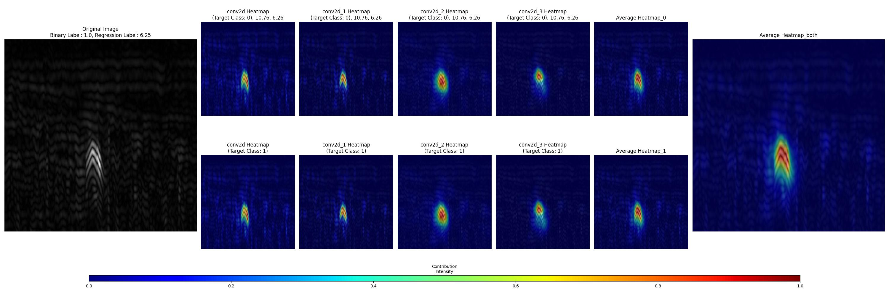
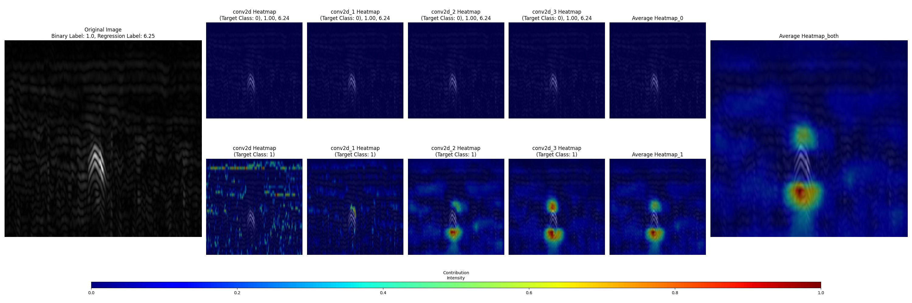
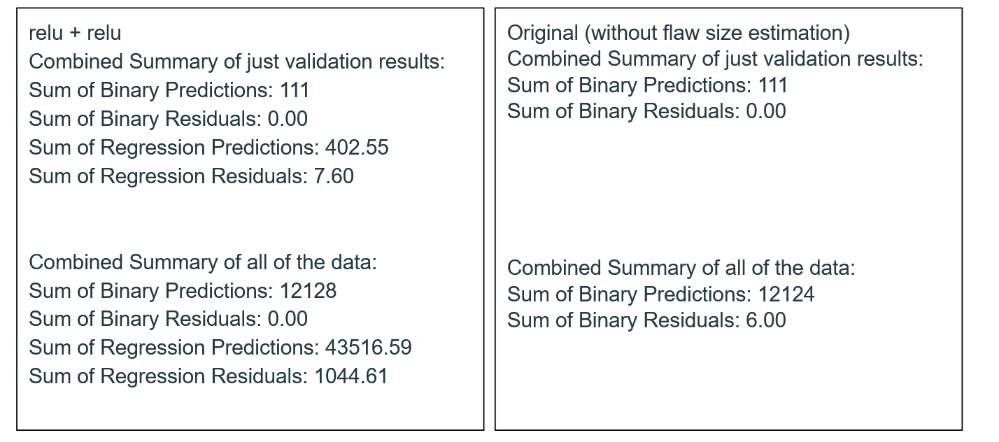

# ML-NDT v2

mod of this original https://github.com/iikka-v/ML-NDT/tree/master 

## detects the size of the flaw

added the ability to train for the flaw size not just flaw presence in the image

## locates the flaw in the image

using inference_my_-----.py one can use grad-cam or score-cam to visualise where in the image the flaw was detected

score-cam relu+relu

grad-cam tanh+relu

## other QOL improvements

also added requirements.txt

use plot_model files to create a graphical representation of the NN

use testing_files/print_res.py to output the performance of the trained NN on the validation (and the entirety of the) dataset

## notes

I felt it not necessary to re-upload the original dataset, download it from the original https://github.com/iikka-v/ML-NDT/tree/master 

the best results were using score-cam and relu+relu activations at the end

grad-cam worked best for tanh+relu. It seems to mainly show the edges of the defect, not the defect itself. It also has issues with saturation.

adding additional output (+ more labels) improved the original NN's performance when testing on the entire dataset 

a short non english presentation can be seen at
https://docs.google.com/presentation/d/1rAR3Dee0S3J8oQNhG6NXNtX9vdKP1VwkIeI6kwKzFx4/edit?usp=sharing 

## results:

Below is the original README.md

---

---

---

---

# ML-NDT
Data and code for training deep convolutional neural network to detect cracks in phased-array ultrasonic data.

Please refer to https://arxiv.org/abs/1903.11399 for details. 

## Contents
The directory "data" contains ultrasonic data sets, containing various flaws. Each batch file is named with an UUID and contains

* .bins file, that contains the raw data
* .meta file, that documents the raw data format, this is always UInt16, 256 x 256 x 100
* .jsons file, that contains a json-formatted meta-data for each binary file. This includes the locations of all flaws, source flaw size and "equivalent size"
* .labels file, that contain tab-separated data for flaw existence (0/1) and equivalent flaw size.

The directory "src" contains python code to train a deep CNN using the data provided. Use "./train.py" to run. 

To make inference, you can consult the sample code in src/inference.py.

